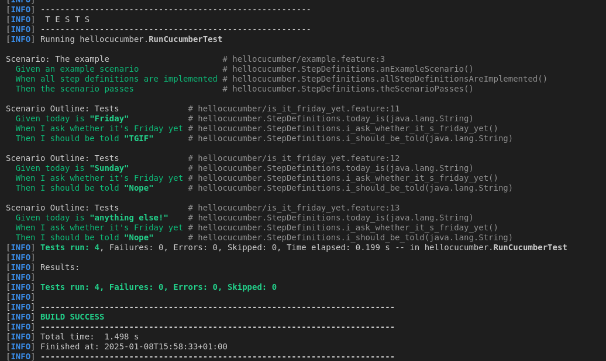
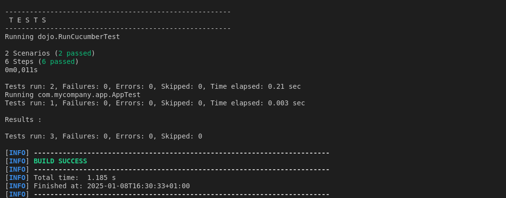
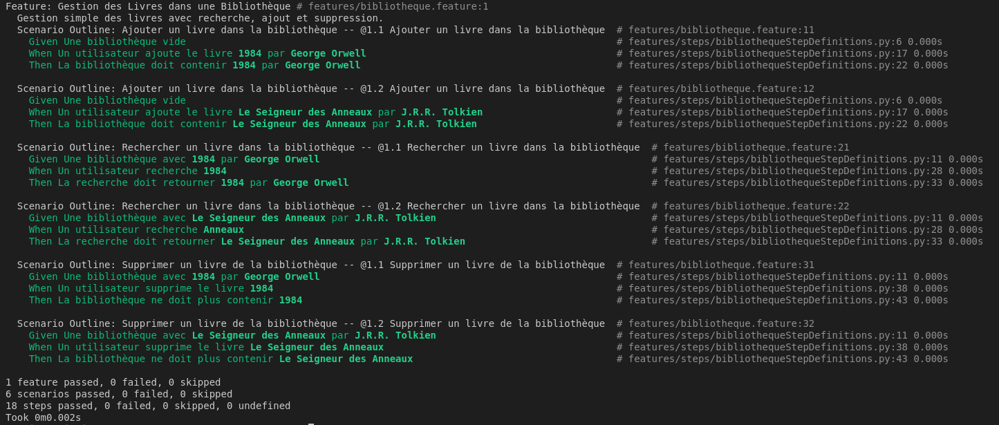

= R5.A.08 -- Dépôt pour les TPs
:icons: font
:MoSCoW: https://fr.wikipedia.org/wiki/M%C3%A9thode_MoSCoW[MoSCoW]

Ce dépôt concerne les rendus de mailto:A_changer@etu.univ-tlse2.fr[Jonh Doe].

== TP1

Code de is_it_friday.feature : 

Feature: Is it Friday yet?
  Everybody wants to know when it's Friday

    Scenario Outline: Tests
        Given today is "<day>"
        When I ask whether it's Friday yet
        Then I should be told "<answer>"

        Examples:
            | day | answer |
            | Friday  | TGIF  | 
            | Sunday  | Nope  |
            | anything else!  | Nope  |

Image de l'exécution des tests :

== TP2

Contenu du fichier Order.java : 

package dojo;

import java.util.ArrayList;
import java.util.List;

public class Order {
    String owner;
    String target;
    List<String> cocktails = new ArrayList<>();

    public void declareOwner(String owner) {
        this.owner = owner;
    }

    public void declareTarget(String target) {
        this.target = target;
    }

    public List<String> getCocktails() {
        return cocktails;
    }
}

Image de l'exécution des tests :

== TP3

Contenu du fichier bibliothèque.feature :

    Feature: Gestion des Livres dans une Bibliothèque
        Gestion simple des livres avec recherche, ajout et suppression.

    Scenario Outline: Ajouter un livre dans la bibliothèque
        Given Une bibliothèque vide
        When Un utilisateur ajoute le livre <titre> par <auteur>
        Then La bibliothèque doit contenir <titre> par <auteur>

        Examples: 
            | titre                  | auteur          |
            | 1984                   | George Orwell   |
            | Le Seigneur des Anneaux | J.R.R. Tolkien  |

    Scenario Outline: Rechercher un livre dans la bibliothèque
        Given Une bibliothèque avec <titre> par <auteur>
        When Un utilisateur recherche <mot-cle>
        Then La recherche doit retourner <titre> par <auteur>

        Examples: 
            | titre                  | auteur          | mot-cle |
            | 1984                   | George Orwell   | 1984    |
            | Le Seigneur des Anneaux | J.R.R. Tolkien  | Anneaux |

    Scenario Outline: Supprimer un livre de la bibliothèque
        Given Une bibliothèque avec <titre> par <auteur>
        When Un utilisateur supprime le livre <titre>
        Then La bibliothèque ne doit plus contenir <titre>

        Examples: 
            | titre                  | auteur          |
            | 1984                   | George Orwell   |
            | Le Seigneur des Anneaux | J.R.R. Tolkien  |

Pour réaliser ce TP, j'ai utilisé le langage Python. En effet, c'est le langage que j'ai utilisé pour ma dernière SAE. 

J'ai donc décidé de l'utiliser pour ce TP pour être prêt. 
J'ai fait un petit CRUD sur une bibliothèque. J'ai donc fait les tests pour ajouter, rechercher et supprimer un livre et ai donc fait les Given, When et Then en conséquence. 

L'objectif que je m'étais de faire des tests qui marche et qui sont cohérents avec les fonctionnalités que j'ai implémenté.

Image de l'exécution des tests :

